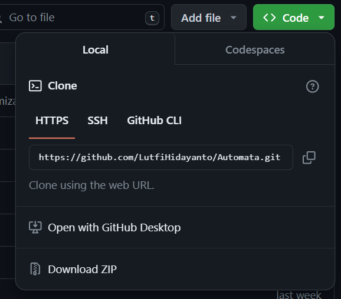
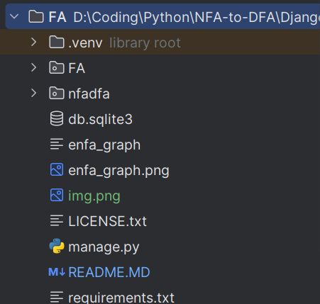

# Panduan Instalasi Program

## Requirements
Pastikan sistem Anda memiliki hal berikut sebelum menginstal dan menjalankan program ini:

- Python (versi 3.x)
- Django (versi yang kompatibel dengan Python 3.x)
- Graphviz

## Langkah-langkah Instalasi

1. **Python**: Jika Anda belum memiliki Python diinstal, Anda bisa mendapatkannya dari [situs web resmi Python](https://www.python.org/downloads/). Ikuti petunjuk instalasi yang disediakan di sana.

2. **Django**: Setelah menginstal Python, Anda bisa menginstal Django menggunakan pip, manajer paket Python. Jalankan perintah berikut di terminal atau command prompt:

    ```
    pip install django
    ```

3. **Graphviz**: Untuk menginstal Graphviz, Anda bisa mengunjungi [situs web resminya](https://graphviz.org/) dan mengikuti petunjuk instalasi yang disediakan.

## Menjalankan Program

Setelah Anda menginstal semua requirements, Anda bisa menjalankan program ini dengan langkah-langkah berikut:

1. **Clone Repositori**: Clone repositori program ini ke dalam sistem Anda Atau mendownload zip code ini lalu extract.

    ```
   git clone https://github.com/LutfiHidayanto/Automata.git
    ```
   


2. **Buka Direktori**: Pindah ke direktori tempat Anda mengkloning repositori/mendownload repositori.

    
    Pastikan root directory project adalah seperti gambar di atas (FA dan nfadfa adalah subdirectory)


4. **Jalankan Server**: Jalankan server Django dengan perintah pada terminal:

    ```
    python manage.py runserver
    ```

5. **Akses Program**: Buka browser web Anda dan akses link yang terdapat pada terminal biasanya http://127.0.0.1:8000/
